# GeoMaster.World - Database Schema

> Drizzle ORM + Turso (SQLite)

```mermaid
erDiagram
    %% ================== AUTH ==================
    users {
        text id PK
        text name
        text nickname
        text email UK
        integer emailVerified
        text image
        text password
        boolean hintEnabled
        boolean isSuperAdmin
    }

    accounts {
        text userId FK
        text type
        text provider PK
        text providerAccountId PK
        text refresh_token
        text access_token
        integer expires_at
        text token_type
        text scope
        text id_token
        text session_state
    }

    sessions {
        text sessionToken PK
        text userId FK
        integer expires
    }

    verificationTokens {
        text identifier PK
        text token PK
        integer expires
    }

    %% ================== GROUPS ==================
    groups {
        text id PK
        text name
        text inviteCode UK
        text ownerId FK
        integer locationsPerRound
        integer timeLimitSeconds
        integer createdAt
    }

    groupMembers {
        text groupId PK
        text userId PK
        text role
        integer joinedAt
    }

    %% ================== LOCATIONS ==================
    locations {
        text id PK
        text name
        text name_de
        text name_en
        text name_sl
        real latitude
        real longitude
        text country
        text difficulty
        integer createdAt
    }

    worldLocations {
        text id PK
        text category
        text name
        text name_de
        text name_en
        text name_sl
        real latitude
        real longitude
        text countryCode
        text additionalInfo
        text difficulty
        integer createdAt
    }

    imageLocations {
        text id PK
        text imageMapId
        text name
        text name_de
        text name_en
        text name_sl
        real x
        real y
        text difficulty
        integer createdAt
    }

    panoramaLocations {
        text id PK
        text mapillaryImageKey
        text name
        text name_de
        text name_en
        text name_sl
        real latitude
        real longitude
        real heading
        real pitch
        text countryCode
        text difficulty
        integer createdAt
    }

    %% ================== GAMES ==================
    games {
        text id PK
        text groupId FK
        text userId FK
        text mode
        text name
        text country
        text gameType
        integer locationsPerRound
        integer timeLimitSeconds
        integer scoringVersion
        integer weekNumber
        integer year
        text status
        integer currentRound
        boolean leaderboardRevealed
        integer activeLocationIndex
        integer locationStartedAt
        text duelSeed
        integer createdAt
    }

    gameRounds {
        text id PK
        text gameId FK
        integer roundNumber
        integer locationIndex
        text locationId
        text locationSource
        text country
        text gameType
        integer timeLimitSeconds
    }

    guesses {
        text id PK
        text gameRoundId FK
        text userId FK
        real latitude
        real longitude
        real distanceKm
        integer timeSeconds
        integer createdAt
    }

    %% ================== STATS ==================
    userStats {
        text id PK
        text userId FK
        text gameType
        integer totalGames
        integer totalRounds
        real totalDistance
        integer totalScore
        integer bestScore
        real averageDistance
        integer updatedAt
    }

    rankedGameResults {
        text id PK
        text gameId FK
        text userId FK
        text guestId
        text gameType
        integer totalScore
        real averageScore
        real totalDistance
        integer completedAt
    }

    rankings {
        text id PK
        text userId FK
        text gameType
        text period
        text periodKey
        integer totalScore
        integer totalGames
        real averageScore
        integer bestScore
        text userName
        text userImage
        integer rank
        integer updatedAt
    }

    userStreaks {
        text id PK
        text userId FK
        integer currentStreak
        integer longestStreak
        text lastPlayedDate
        integer updatedAt
    }

    %% ================== DUELS ==================
    duelResults {
        text id PK
        text duelSeed
        text gameType
        text challengerId FK
        text challengerGameId FK
        integer challengerScore
        integer challengerTime
        text accepterId FK
        text accepterGameId FK
        integer accepterScore
        integer accepterTime
        text winnerId FK
        integer createdAt
    }

    duelStats {
        text id PK
        text userId FK
        text gameType
        integer totalDuels
        integer wins
        integer losses
        real winRate
        integer rank
        integer updatedAt
    }

    %% ================== GAME TYPES ==================
    countries {
        text id PK
        text name
        text name_en
        text name_sl
        text icon
        text geojson_data
        text landmark_image
        text background_image
        text card_image
        text flag_image
        real center_lat
        real center_lng
        integer default_zoom
        integer min_zoom
        real bounds_north
        real bounds_south
        real bounds_east
        real bounds_west
        integer timeout_penalty
        integer score_scale_factor
        boolean is_active
        integer createdAt
    }

    worldQuizTypes {
        text id PK
        text name
        text name_en
        text name_sl
        text icon
        text landmark_image
        text background_image
        real center_lat
        real center_lng
        integer default_zoom
        integer min_zoom
        integer timeout_penalty
        integer score_scale_factor
        boolean is_active
        integer createdAt
    }

    panoramaTypes {
        text id PK
        text name
        text name_en
        text name_sl
        text icon
        text landmark_image
        text background_image
        real center_lat
        real center_lng
        integer default_zoom
        integer min_zoom
        integer timeout_penalty
        integer score_scale_factor
        integer default_time_limit_seconds
        boolean is_active
        integer createdAt
    }

    %% ================== SYSTEM ==================
    activityLogs {
        text id PK
        integer timestamp
        text level
        text category
        text action
        text userId FK
        text targetId
        text targetType
        text details
        text metadata
    }

    newsItems {
        text id PK
        text title
        text title_en
        text content
        text content_en
        text link
        text link_text
        text link_text_en
        integer createdAt
    }

    registrationAttempts {
        text id PK
        text ip
        integer attemptedAt
        boolean success
    }

    notifications {
        text id PK
        text userId FK
        text type
        text title
        text message
        text link
        text metadata
        boolean isRead
        integer createdAt
    }

    %% ================== RELATIONSHIPS ==================
    users ||--o{ accounts : has
    users ||--o{ sessions : has
    users ||--o{ groups : owns
    users ||--o{ groupMembers : joins
    groups ||--o{ groupMembers : contains
    groups ||--o{ games : has
    users ||--o{ games : plays
    games ||--o{ gameRounds : contains
    gameRounds ||--o{ guesses : has
    users ||--o{ guesses : makes
    users ||--o{ userStats : has
    users ||--o{ rankedGameResults : achieves
    games ||--o{ rankedGameResults : produces
    users ||--o{ rankings : ranked
    users ||--o| userStreaks : has
    users ||--o{ duelResults : participates
    games ||--o{ duelResults : linked
    users ||--o{ duelStats : has
    users ||--o{ activityLogs : triggers
    users ||--o{ notifications : receives
```

## Tables Overview

| Category | Tables |
|----------|--------|
| **Auth** | `users`, `accounts`, `sessions`, `verificationTokens` |
| **Groups** | `groups`, `groupMembers` |
| **Locations** | `locations`, `worldLocations`, `imageLocations`, `panoramaLocations` |
| **Games** | `games`, `gameRounds`, `guesses` |
| **Stats** | `userStats`, `rankedGameResults`, `rankings`, `userStreaks` |
| **Duels** | `duelResults`, `duelStats` |
| **Game Types** | `countries`, `worldQuizTypes`, `panoramaTypes` |
| **System** | `activityLogs`, `newsItems`, `registrationAttempts`, `notifications` |

## Key Relationships

- **Users** own groups, play games, make guesses
- **Games** can be group-based, training, ranked, or duels
- **GameRounds** link to locations from 4 different sources (locations, worldLocations, imageLocations, panoramaLocations)
- **Rankings** are aggregated by period (daily/weekly/monthly/alltime) and gameType
